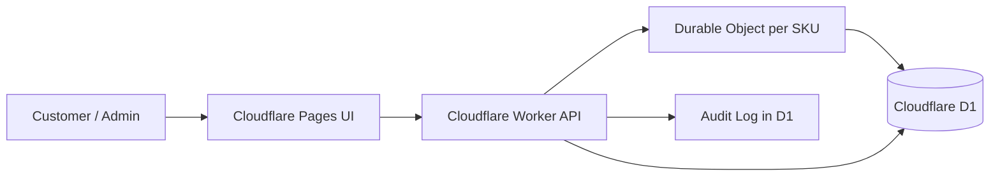

# Inventory Reservation System

An edge-native inventory reservation service built on Cloudflare. It is designed to prevent overselling when many users try to reserve the same limited-stock product at the same time.

## What This Service Uses

This project is built with:

- Cloudflare Pages for the customer-facing web app
- Cloudflare Worker for the API
- Cloudflare Durable Objects for per-SKU concurrency control
- Cloudflare D1 for persistent data storage
- React + Vite for the frontend
- TypeScript across the whole stack
- Hono for HTTP routing
- Zod for request validation

The repository is split into two main workspaces:

- `apps/web` - frontend UI deployed to Cloudflare Pages
- `workers/api` - API deployed as a Cloudflare Worker

## Why This Is Built on Cloudflare

Cloudflare fits this workload very well because the service is naturally edge-shaped:

- Cloudflare Workers give you serverless compute with very low operational overhead.
- Cloudflare Pages makes the frontend easy to deploy with preview environments.
- Cloudflare D1 provides a simple SQLite-backed database without managing servers.
- Cloudflare Durable Objects solve the hardest part of reservation systems: safe concurrent writes.

The key advantage is not just "serverless". It is the combination of:

1. Stateless API entry points at the edge
2. A stateful coordination primitive for hot inventory records
3. Persistent storage for durable truth

That combination is a strong fit for flash sales, limited drops, and any workflow where a lot of users compete for the same stock.

## High-Level Architecture



## Architecture

The system uses a split-brain design in the good sense: stateless edge requests for normal API traffic, and stateful coordination only where contention exists.

### Cloudflare Pages

The frontend is deployed as static assets on Cloudflare Pages. It serves the customer flow and the admin UI close to users, with preview deployments available for branch-based development.

### Cloudflare Worker

The Worker is the API gateway. It handles:

- routing
- request validation
- authentication for admin and internal endpoints
- rate limiting
- scheduled expiry sweeps
- orchestration between the frontend, D1, and Durable Objects

### Cloudflare Durable Objects

Each SKU gets its own Durable Object instance. That instance serializes all inventory mutations for that SKU, which prevents two reserve requests from racing each other into an oversell.

This is the core concurrency mechanism of the system.

### Cloudflare D1

D1 stores the durable state:

- products
- inventory balances
- reservations
- orders
- audit logs

The database is the source of truth. The Durable Object is the coordinator that keeps writes safe.

## Project Structure

```text
inventory-reservation/
├── apps/
│   └── web/                  # Cloudflare Pages frontend
│       ├── src/
│       │   ├── pages/        # Customer and admin pages
│       │   ├── components/   # Shared UI components
│       │   ├── lib/          # API client, constants, utilities
│       │   └── styles/       # Global and page styles
│       └── public/           # Static assets
├── workers/
│   └── api/                  # Cloudflare Worker API
│       ├── src/
│       │   ├── routes/       # HTTP route handlers
│       │   ├── services/     # Business logic and orchestration
│       │   ├── repositories/ # D1 access layer
│       │   ├── durable-objects/ # Per-SKU concurrency engine
│       │   ├── middleware/   # Auth, rate limit, error handling
│       │   ├── validators/   # Zod schemas
│       │   └── utils/        # Shared response and error helpers
│       ├── migrations/       # D1 schema and seed data
│       └── test/             # Concurrency and lifecycle tests
├── docs/                     # Architecture, API contract, runbook
└── package.json              # Workspace scripts
```

## How Reservation Works

The reservation flow is intentionally simple from the user perspective, but carefully coordinated under the hood.

### 1. Browse products

The frontend reads product and stock information from the API:

- `GET /api/products`
- `GET /api/products/:sku`

This is a read path. It does not need Durable Object coordination because it does not mutate inventory.

### 2. Create a reservation

When a customer clicks reserve, the frontend sends:

- `POST /api/reservations`
- `Idempotency-Key: <unique-key>`
- body with `sku` and `quantity`

The worker then:

1. Validates the request with Zod
2. Looks up the product by SKU
3. Routes the write to the Durable Object for that product
4. Lets the Durable Object serialize the mutation
5. Writes the reservation and audit log to D1

The reservation is created with a hold period of 15 minutes.

## Reservation Lifecycle

Reservations move through a small state machine:

```text
pending -> confirmed
pending -> cancelled
pending -> expired
```

### Pending

The stock is reserved but not yet committed to an order. This is the temporary hold window that protects the customer while checkout completes.

### Confirmed

The reservation has been converted into an order. The stock is no longer available to others.

### Cancelled

The customer or system released the hold before confirmation. Stock returns to the available pool immediately.

### Expired

The hold timed out after 15 minutes. Stock is released automatically by the Durable Object, either lazily during the next write or by the scheduled sweep.

### Inventory arithmetic

The system keeps stock accounting explicit:

- `total_stock` = physical or allocated stock
- `reserved_count` = units currently held by pending reservations
- `confirmed_count` = units already sold
- `available_stock` = `total_stock - reserved_count - confirmed_count`

This makes the system easy to reason about and easy to audit.

### 3. Confirm the reservation

If checkout succeeds, the client confirms the reservation:

- `POST /api/reservations/:id/confirm`
- `Idempotency-Key: <unique-key>`

The confirm step:

1. Finds the reservation
2. Routes to the same Durable Object for that SKU
3. Checks that the reservation is still valid
4. Converts the reservation into an order
5. Updates stock counters consistently

### 4. Cancel or expire

Reservations can end in two ways:

- `POST /api/reservations/:id/cancel` releases the stock immediately
- Expired reservations are released automatically

Expiry is handled twice:

1. Lazily, before any new mutation for that SKU
2. By a scheduled Worker sweep every 5 minutes

That dual approach keeps the system clean even if a product goes quiet after heavy traffic.

## Why the Design Is Smart

The interesting part of this service is not the UI. It is the concurrency model.

### Per-SKU serialization

Each product SKU is assigned its own Durable Object instance. That means all writes for one SKU go through one serialized execution lane.

This is effectively an actor model for inventory:

- one SKU
- one owner of the write path
- one ordered stream of mutations

That is a clean way to eliminate oversell races without building a full distributed lock service.

### Strong consistency where it matters

The system does not try to make everything strongly consistent. It is selective.

- Reads can come directly from D1
- Writes that affect stock go through the Durable Object
- Expiry cleanup can be lazy or scheduled

That is a practical design: spend strong guarantees only on the contention hot path.

### Idempotency is built in

Reservation and confirmation requests require an `Idempotency-Key`.

Why this matters:

- retries do not create duplicate reservations
- flaky clients do not double-charge or double-reserve
- network timeouts can be retried safely

This is one of the most important production-grade details in a reservation system.

### Auditability is first-class

Every meaningful inventory mutation writes an audit log entry.

That gives you:

- traceability
- operational debugging
- a paper trail for admin actions

### Two-layer expiry cleanup

Expired reservations are cleared in two ways:

- on-demand before any new mutation for the same SKU
- on a cron schedule so quiet SKUs do not stay stale forever

This is a good example of resilient design: the system is correct during activity and still self-healing when traffic drops off.

### D1 is the durable truth

D1 stores:

- products
- inventory
- reservations
- orders
- audit logs

The Durable Object is not the database. It is the coordinator. D1 remains the source of record.

That separation keeps the system understandable:

- DO = coordination and serialization
- D1 = persistence and reporting

## Consistency Model

| Operation | Consistency | Notes |
|-----------|-------------|-------|
| Reserve | Strong | Serialized by Durable Object |
| Confirm | Strong | Serialized by Durable Object |
| Cancel | Strong | Serialized by Durable Object |
| Expire | Eventual | Lazy cleanup + cron sweep |
| Product listing | Eventual | Direct D1 read |
| Admin reporting | Eventual | Direct D1 read |

## Reservation State

```text
pending -> confirmed
pending -> cancelled
pending -> expired
```

- `pending` means stock is temporarily held
- `confirmed` means the hold became an order
- `cancelled` means the hold was released manually
- `expired` means the hold timed out and was released automatically

## Key Endpoints

### Public

- `GET /api/products`
- `GET /api/products/:sku`
- `POST /api/reservations`
- `GET /api/reservations/:id`
- `POST /api/reservations/:id/confirm`
- `POST /api/reservations/:id/cancel`

### Admin

- `POST /api/admin/products`
- `POST /api/admin/inventory/adjust`
- `GET /api/admin/reservations`
- `GET /api/admin/orders`
- `GET /api/admin/audit-log`

## Local Development

### Prerequisites

- Node.js 22+
- npm 10+
- Wrangler CLI

### Install

```bash
npm install
```

### Run API locally

```bash
npm run dev:api
```

### Run frontend locally

```bash
npm run dev:web
```

### Run tests

```bash
npm test
```

## Deployment Notes

The frontend is intended for Cloudflare Pages and the API for Cloudflare Workers.

For local development and simple static hosting, the web app can proxy API calls to the Worker.

The worker uses D1 migrations and a Durable Object namespace for the reservation engine.

## What to Look At in the Code

- `workers/api/src/durable-objects/inventory-reservation.ts` for the concurrency model
- `workers/api/src/services/reservation.ts` for the reservation orchestration
- `workers/api/src/routes/` for the HTTP surface
- `workers/api/src/repositories/` for D1 access
- `apps/web/src/pages/` for the customer and admin UI

## Proof It Handles Contention

The test suite includes concurrency coverage that simulates many simultaneous reservation attempts against limited stock. The expected result is that:

- only the available stock succeeds
- the rest fail with `INSUFFICIENT_STOCK`
- inventory never goes negative

That is the core property this service is built to guarantee.
